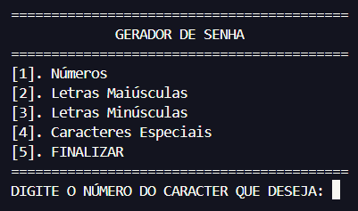
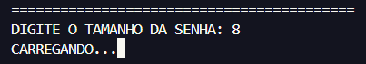
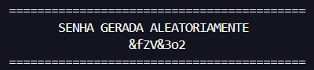

 <h1><b>Gerador de Senhas em Python</b></h1>
 
Este projeto é um gerador de senhas escrito em Python, projetado para criar senhas fortes e seguras de forma rápida e fácil. Ele oferece uma interface simples e intuitiva, permitindo que os usuários personalizem a complexidade e o comprimento das senhas geradas. Ideal para quem precisa de senhas únicas e robustas para proteger suas contas e dados pessoais.

 
 <h2><b>Funcionalidades</b></h2>
 <h3><b>- Opções de Seleção de Caracteres</b></h3>
 
 
Permite aos usuários escolher quais tipos de caracteres incluir na senha: letras maiúsculas, letras minúsculas, números e caracteres especiais.

 
 <h3><b>- Comprimento da Senha Personalizável</b></h3>
 
 
Os usuários podem especificar o comprimento desejado da senha para atender aos requisitos específicos de segurança.

 
 <h3><b>- Geração Aleatória de Senhas</b></h3>
 
 
Gera uma senha completamente aleatória a cada vez, garantindo que nenhuma senha seja igual a outra.

